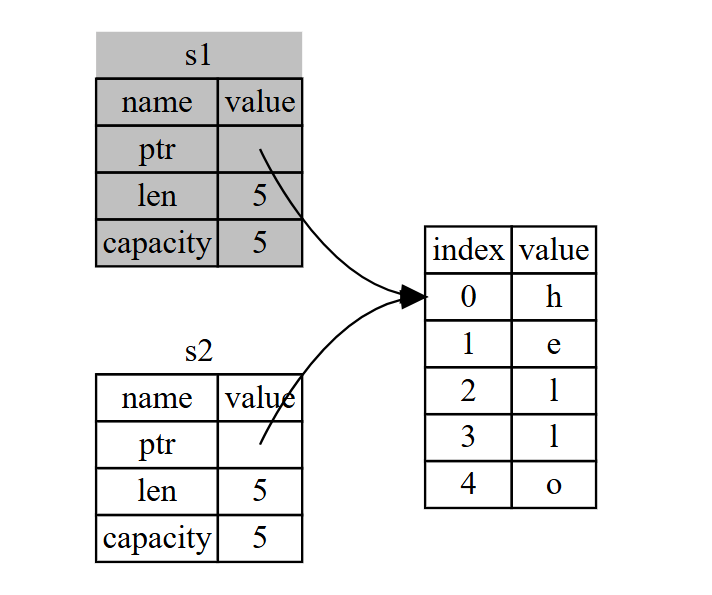
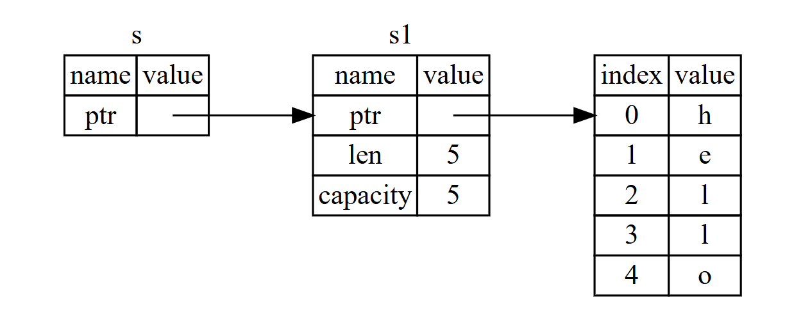
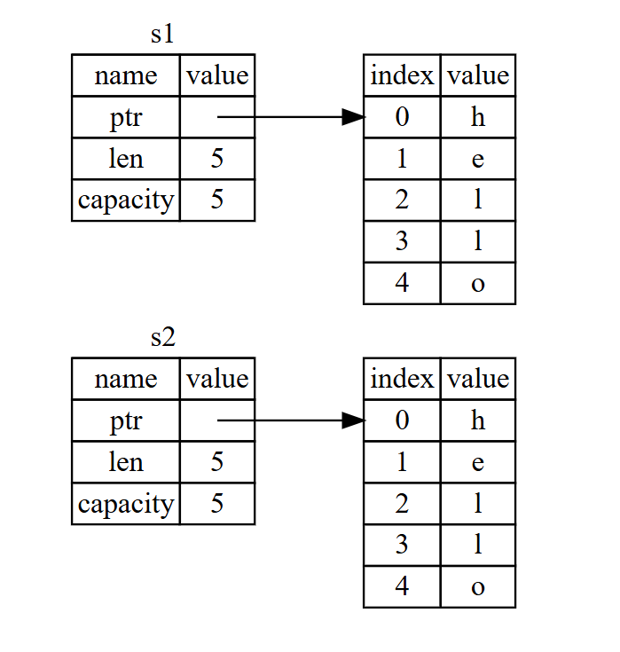

## 内容目录

* 赋值 引用 克隆
* 引用特性
* 权限转移
* 切片

## 基本规则

* 每个值都有一个所有者。
* 一次只能有一个所有者。
* 当所有者超出作用域时，值将被丢弃。

## 赋值 引用 克隆

||赋值|引用|克隆|  
|:--:|:--:|:--:|:--:|
|语法|``s1 = s2``|``s1 = (mut) & s2 ``|``s1 = s2.clone()``|
|所有权|转移|借用|复制|


<br />
<br />
<br />
<br />
<br />
<br />
<br />
<br />
<br />
<br />
<br />
<br />
<br />
<br />
<br />
<br />
<br />
<br />
<br />
<br />
<br />
<br />
<br />
<br />
<br />
<br />
<br />

```
s1 = s2;
```

<br />



<br />
<br />
<br />
<br />
<br />
<br />
<br />
<br />
<br />
<br />
<br />
<br />
<br />
<br />
<br />

```
s = &s1;
```

<br />



<br />
<br />
<br />
<br />
<br />
<br />
<br />
<br />
<br />
<br />
<br />
<br />
<br />
<br />
<br />
<br />
<br />
<br />
<br />
<br />
<br />
<br />
<br />
<br />
<br />

```
s1 = s2.clone();
```
<br />



<br />
<br />
<br />
<br />
<br />
<br />
<br />
<br />
<br />

## 引用

* 在任何给定的时刻，你可以有一个可变引用或者任意数量的不可变引用。
* 引用必须始终是有效的。  

<br />

数据竞争：
* 同时有两个或更多的指针访问相同的数据。
* 至少有一个指针被用来写入数据。
* 没有使用任何机制来同步对数据的访问。
